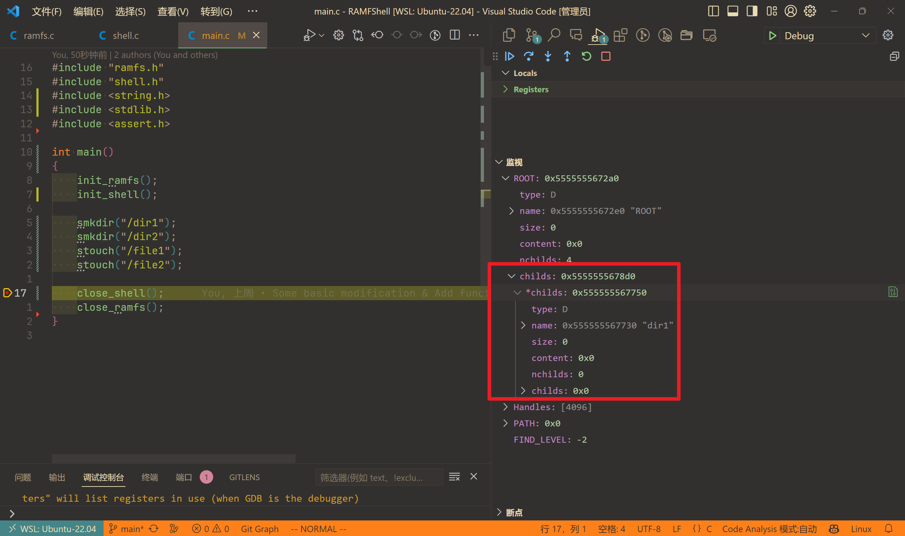
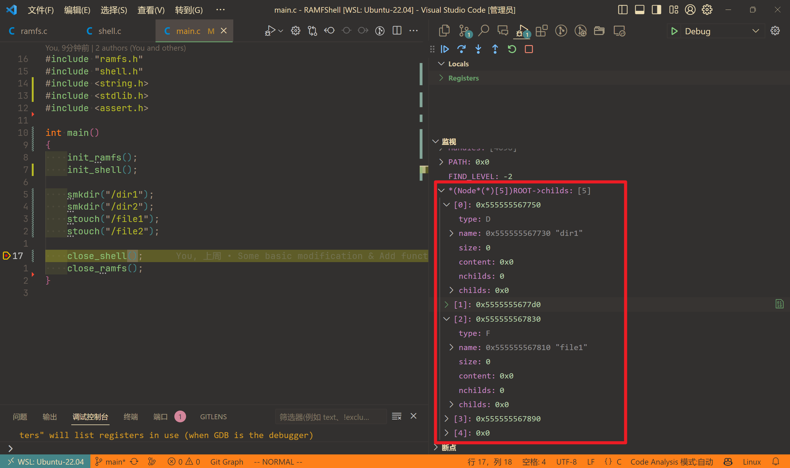
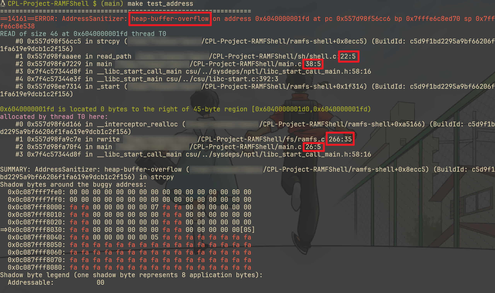
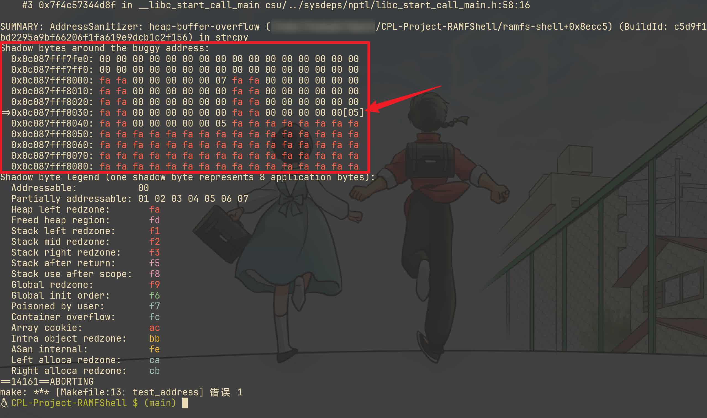

# CPL Project RAMFShell

> [原 README](./README.origin.md)，[项目框架仓库](https://git.nju.edu.cn/KYCoraxxx/ramfshell)。

**本 README 可能在 GFM 显示效果不是很好，同时内容不会同步更新，建议去[相应博文](https://pilgrimlyieu.github.io/2024/01/cpl-project-review)查看。**

## 前言

只是对这次项目大作业进行一个反思，并不会去分析代码，因此在 DDL 前发出来也没什么。

首先得感谢一下我自己，开了个时间表，前几天异常专注努力（现在基本又靠近常态了），把其它作业早早解决了，让我能在比较早的时间开始项目。现在看来真是时间卡得很紧，昨天才过了，今天就 DDL，太刺激了。

尽管写得比较烂，但也是 C 语言最大的一个项目了（当然也是第一个项目），即使在我写过寥寥无几的代码中，也是仅次于 OCRC 的工程量了（写的应该比 OCRC 好一点）。由于其特殊的纪念意义，就在 [GitHub 开源](https://github.com/pilgrimlyieu/CPL-Project-RAMFShell)，当然目前还是 Private 状态，我等软院 DDL 结束后再改 Public。

回顾大概是翻 commits history，同时看看提交记录，想到啥写啥，可能会有遗漏。

前言也顺便提一下为什么要选这个题目。

首先排除做游戏，因为这些游戏我都不感兴趣，而且我认为做游戏的工程量还是比较大的（听说有人写了两万行，还是单文件，我整个 AutoHotkey 代码总量也不过万行，这样的代码即使有拆成多文件我想我也是难以维护的），而且做游戏还要学啥 SDL 图形库，我也没啥兴趣。

然后自选，我也不是没有想法，但是呢工程量相较于给的题目来说太小了。其次呢，主观题拿满分对我而言几乎不可能，因此从功利的角度来说做游戏也不是好选择。

客观题除了这个还有 SQL-Minus 与霓虹麻将。后者显然直接排除，类游戏的，不感兴趣。前者是有一点兴致的，我也可以借此机会了解一下 SQL。但是呢，我也提到过了，出于我对 RAMFShell 这个更感兴趣，同时它有个项目框架，我可以学习一下 VSCode 与 WSL 联动写 C 项目的流程，因此最终确定了这个选题。

## 准备

### 基本布置

还好把副屏带回来了。写代码前，副屏看文档与项目 README，主屏记笔记；写代码时，主屏写代码，副屏测试、提交或者看文档 README 等。

### WSL

项目推荐使用 Linux 系统。但我轻薄本带不动虚拟机，而 WSL 又已经使用一段时间了，使用体验非常好，当然就用上了 WSL。

WSL 的好处不必多说了，跟 Windows 衔接好、编译执行快…我在此前用 WSL 做笔记，写 $\LaTeX$ 等时就已经体会到了。

### VSCode

#### 选择

同时决定了使用 VSCode。为什么呢？因为 VSCode 有 WSL 插件，可以直接用 VSCode 打开 WSL 的项目写代码，而不用在 WSL 里面再装个编辑器或者是庞大的 IDE。

但是呢，我也提到过了，我平时的 OJ 作业都是用 CLion 的，而且 CLion 也有 WSL 工具链，还有 Gateway 这样的远程开发环境，同时 CLion 作为一个成熟的 IDE，显然会有更方便的配置和体验更好的代码补全、提示与调试功能，那我为什么不用 CLion 呢？

原因其一，自然是因为我搜阅了网上相关文章，发现评价并不好，体验比 VSCode 差。其二，CLion 占用资源太多了，每次开个 CLion 风扇要呼呼转，然后我还得开个 WSL。

那为什么不用 Vim 呢？WSL 上的 Vim 的问题已经基本解决了，已经能获得跟 Windows 上差不多的体验了，而且 Vim 上一堆插件，比如 vim-easy-align，不是可以很方便地对齐美化代码吗？而且 Vim 的操作不是比 VSCode 残缺功能的 Vim 插件更方便吗？那为什么不用 Vim 呢？

原因其一，Vim 没配调试环境，完全无法调试（没学过 `gdb`）。其二，代码高亮不好看，这也是 Vim 写代码的通病，所以基本不用 Vim 写代码，都是写 markdown 或 $\LaTeX$。相较而言，VSCode 高亮就很漂亮，写代码也是美的享受。

当然也不是一点 Vim 都没用，还是会打开一些文件，对齐一下代码什么的，只不过 VSCode 是主力罢了。

也不是说 VSCode 就完美无瑕。也遇到过一些问题，比如说调试时卡在某一行（一般是调用库函数的行），按单步执行动不了，这种情况我一般在下一步下个断点，然后恢复执行，就能越过去了。但是只是一开始写代码时遇到了，后面没遇到了，网上也没搜到类似问题，可能是初期代码的内存问题？

还有呢就是 VSCode Vim 一些不太方便的问题。但是总的来说没用过什么奇技淫巧，都是很基础的操作，还是写得很舒服的。基本上就用了基本的移动键和修改键，<kbd>v</kbd> 选中代码，<kbd>,</kbd> 重复跳转，<kbd>.</kbd> 重复操作，<kbd>s</kbd> 修改 surroundings 的内容，<kbd>u</kbd> 撤回与重做，<kbd>y</kbd> 复制，<kbd>Ctrl</kbd> + <kbd>O</kbd>/<kbd>I</kbd> 来回跳，<kbd>/</kbd>/<kbd>n</kbd> 搜索与跳转，<kbd>z</kbd> 折叠，<kbd>:</kbd> 然后 `:%y` 复制全部…

#### 配置

既然决定是 VSCode 了，自然要学习一下怎么使用 VSCode 写 C 项目。

我的 `.vscode` 有四个文件，一一来介绍一下。

```json settings.json
{
    "C_Cpp.codeAnalysis.clangTidy.checks.disabled": [
        "clang-analyzer-security.insecureAPI.strcpy",
        "clang-analyzer-security.insecureAPI.DeprecatedOrUnsafeBufferHandling"
    ]
}
```

`settings.json` 禁掉了两个检查，因为第一个检查会警告我 `strcpy` 不安全，第二个检查会警告我 `strncpy` `memset` `memcpy` 等等不安全。但我一定是要用的，而这些检查挺烦人的，就关掉了。

```json c_cpp_properties.json
{
    "configurations": [
        {
            "name": "Linux",
            "includePath": [
                "${workspaceFolder}/include"
            ],
            "defines": [
                "_DEBUG",
                "UNICODE",
                "_UNICODE"
            ],
            "compilerPath": "/usr/bin/clang",
            "cStandard": "c17",
            "intelliSenseMode": "linux-clang-x64",
            "compilerArgs": [
                "-O2",
                "-lm",
                "-march=native",
                "-fno-strict-aliasing",
                "-Wall",
                "-fdiagnostics-color=always"
            ]
        }
    ],
    "version": 4
}
```

`c_cpp_properties.json` 是 VSCode 的 C/C++ 插件的配置文件。之前用的是 Clangd 插件，现在用回自带的插件了。

`includePath` 里包含了 `include` 目录，这样就不会报错找不到头文件了，而且可以带来更好的补全体验。

`defines` 忘了哪里来的，没啥印象。

`intelliSenseMode` 用的是 `linux-clang-x64`，因为给了更多提示，我一个内存泄漏问题就是它检查出来的。而一开始用 `linux-gcc-x64`，它就只一直在说上面不安全的问题。同时为了搭配使用，也用了 `clang` 作为编译器，毕竟对我这个水平的代码来说，编译器没啥差别。

`cStandard` 和 `compilerArgs` 抄的 OJ 上面的。大致含义：`-O2` 是开启二级优化，`-lm` 是链接数学库，`-march=native` 也是优化，`-fno-strict-aliasing` 是禁用严格别名规则，`-Wall` 是开启所有警告，`-fdiagnostics-color=always` 是开启彩色信息输出。

```json launch.json
{
    "version": "0.2.0",
    "configurations": [
        {
            "name": "Debug",
            "type": "cppdbg",
            "request": "launch",
            "program": "${workspaceFolder}/ramfs-shell",
            "args": [],
            "stopAtEntry": false,
            "cwd": "${workspaceFolder}",
            "environment": [],
            "externalConsole": false,
            "MIMode": "gdb",
            "preLaunchTask": "C Project Build",
            "setupCommands": [],
        }
    ]
}
```

`launch.json` 是调试配置文件。取了个朴实无华的名字 `Debug`。执行的目标程序是 `ramfs-shell`，执行前先执行一个 task 叫做 `C Project Build`。

```json tasks.json
{
    "tasks": [
        {
            "type": "cppbuild",
            "label": "C Project Build",
            "command": "/usr/bin/clang",
            "args": [
                "-g",
                "${file}",
                "-o",
                "${workspaceFolder}/ramfs-shell",
                "-I",
                "${workspaceFolder}/include",
                "fs/ramfs.c",
                "sh/shell.c",
                "-lm",
                "-march=native",
                // "-fsanitize=address",
                // "-fsanitize=undefined",
                // "-fsanitize=leak",
                // "-fsanitize=memory",
                // "-fsanitize=thread",
                "-fno-strict-aliasing",
                "-fno-omit-frame-pointer",
                "-ftrapv",
                "-Wall",
                "-fdiagnostics-color=always"
            ],
            "options": {
                "cwd": "${workspaceFolder}"
            },
            "problemMatcher": [
                "$gcc"
            ],
            "group": {
                "kind": "build",
                "isDefault": true
            },
            "detail": "",
        }
    ],
    "version": "2.0.0"
}
```

这就是 `tasks.json`，只有这一个 task——`C Project Build`，也是用 `clang`。比起前面，多了点参数，比如 `-g` 是开启调试信息，`-o` 是输出文件名，`-I` 是包含头文件目录，`-fsanitize` 是开启内存检查（注释掉了，调试时只开过 address），`-fno-omit-frame-pointer` 是网上抄的，`-ftrapv` 是检查整数溢出（也是网上抄的）。

总的来说，没什么好说的。可能有点问题，不过我用着没出问题就是了，还有人找我抄配置，我也给了（其实蛮好奇，发起聊天就行了为啥要加好友呢，虽然发起聊天不能发文件）。

#### 技巧

还有就是一些学到的技巧（其实就一个）。



这是一个简单的程序，在根目录分别创建了两个文件夹和两个文件。但是呢右边的监视变量里面，却只能显示首地址，实在是不方便。

于是我在 StackOverflow 的问题 [How to watch char values of strings pointed by a pointer to pointers in debugger mode of VSCode](https://stackoverflow.com/questions/63278898/how-to-watch-char-values-of-strings-pointed-by-a-pointer-to-pointers-in-debugger) 上找到了答案。

当然，其实我是从问题描述学的，实际上就是用 `*(Node*(*)[5])` 就行了，5 是一个自定义的数字，代表数组的长度。这样就能把指针转化为数组来显示了，比较清晰。



也就是说，如果一个 `TYPE*` 类型的指针，那么 `*(TYPE(*)[LEN])` 就能把它转化为数组来显示。

这个问题其实问的是另一种情况，也就是 `TYPE**` 类型的指针，想要转成数组型，同时每个元素也还是数组型，例如说一个字符串数组 `char**`，想要用数组显示每一个字符串，同时每一个字符串以数组形式显示每个字符，就可以用 `(TYPE(*(*)[N]))`，N 是字符串个数。

类型解读记不太清了，因此也不太会解读，有时间重新看一看那篇顺时针解读 C 语言的复杂声明的文章。

### `Makefile`

#### 禁止编译自动 commit

一开始就打算了最后要把项目传到 GitHub，如果是默认的 compile 自动 commit，那 commits history 就毫无用处了。因此一开始就禁掉。这个早在开始写项目之前大半个月就弄了，去年年底就做了。

```diff
diff --git a/Makefile b/Makefile
index 13ed87c..9985dea 100644
--- a/Makefile
+++ b/Makefile
@@ -4,7 +4,7 @@ INC_PATH := include/
 
 all: compile
 
-compile: git
+compile:
 	@gcc -g -std=c17 -O2 -I$(INC_PATH) main.c fs/ramfs.c sh/shell.c -o ramfs-shell
 
 run: compile
 ```

只看了教材关于 Makefile 的部分介绍，课本只是用来联合编译，现在才发现还有别的用途。

至于说会不会给怀疑抄袭作弊，那当然不可能，毕竟我有 100+ commits，而且基本上每个 commit message 都有认真写（虽然说没学习规范，但好歹不是全是单个 `update` 或者 `fix` 什么的），同时还有非常多的提交测评记录，而且还在相关群问过问题、求过样例，所以这种事情完全不担心的。

#### 提交

```makefile Makefile
submit:
	$(eval TEMP := $(shell mktemp -d))
	$(eval BASE := $(shell basename $(CURDIR)))
	$(eval FILE := ${TEMP}/${TOKEN}.zip)
	@cd .. && zip -qr ${FILE} ${BASE}/.git
	@echo "Created submission archive ${FILE}"
	@curl -m 15 -w "\n" -X POST -F "TOKEN=${TOKEN}" -F "FILE=@${FILE}" \
		https://public.oj.cpl.icu/api/v2/submission/lab
	@rm -r ${TEMP}
```

首先是把提交超时时间从 5 改成 15，5 和 10 都有超时过。然后还改成了 public.oj.cpl.icu，因为 oj.cpl.icu 交不上，估计是代理的问题，也懒得弄，索性用 public 的交。

#### TOKEN

TOKEN 要保密，而 Makefile 又是要 commit 的。因此根目录下有一个 `TOKEN` 文件，里面写了 TOKEN，然后 Makefile 里面就是读取这个文件。

```makefile Makefile
TOKEN := $(shell cat TOKEN)
```

也是查的，因为我自己不会写。

#### 测试

然后自己加了一点测试

```makefile Makefile
test_address:
	@clang -fsanitize=address -fno-omit-frame-pointer -ftrapv -Wall -fdiagnostics-color=always -g -std=c17 -O2 -I$(INC_PATH) main.c fs/ramfs.c sh/shell.c -o ramfs-shell
	@./ramfs-shell

test_undefined:
	@clang -fsanitize=undefined -fno-omit-frame-pointer -ftrapv -Wall -fdiagnostics-color=always -g -std=c17 -O2 -I$(INC_PATH) main.c fs/ramfs.c sh/shell.c -o ramfs-shell
	@./ramfs-shell

test_leak:
	@clang -fsanitize=leak -fno-omit-frame-pointer -ftrapv -Wall -fdiagnostics-color=always -g -std=c17 -O2 -I$(INC_PATH) main.c fs/ramfs.c sh/shell.c -o ramfs-shell
	@./ramfs-shell

test_memory:
	@clang -fsanitize=memory -fno-omit-frame-pointer -ftrapv -Wall -fdiagnostics-color=always -g -std=c17 -O2 -I$(INC_PATH) main.c fs/ramfs.c sh/shell.c -o ramfs-shell
	@./ramfs-shell

test_thread:
	@clang -fsanitize=thread -fno-omit-frame-pointer -ftrapv -Wall -fdiagnostics-color=always -g -std=c17 -O2 -I$(INC_PATH) main.c fs/ramfs.c sh/shell.c -o ramfs-shell
	@./ramfs-shell
```

用 `clang` 还有一个原因是，`gcc` 不能用 `-fsanitize=memory` 等，不如就全用 `clang` 了。不过 `compile` 还是用的 `gcc`，毕竟 OJ 那边也是 `gcc`。

### `use.sh`

给了五个样例，要调试的话一个一个自己换太麻烦了，因此让 Copilot 写了个脚本自动化，甚至还有 Usage。样例全放在 `sample` 文件夹（我自己加了个测试，所以是六个）。能看懂大概，但让我自己写肯定不会写。使用前先 `chmod +x use.sh`。

```bash use.sh
#!/bin/bash

# chmod +x use.sh

# 定义样例数量
SAMPLE_COUNT=6

# 检查参数数量
if [ "$#" -ne 1 ]; then
    echo "Usage: $0 <number>"
    exit 1
fi

# 检查参数是否为整数
if ! [[ "$1" =~ ^[0-9]+$ ]]; then
    echo "Error: Argument must be an integer."
    exit 1
fi

# 检查参数是否在 1 到 SAMPLE_COUNT 之间
if [ "$1" -lt 1 ] || [ "$1" -gt $SAMPLE_COUNT ]; then
    echo "Error: Number must be between 1 and $SAMPLE_COUNT."
    exit 1
fi

# 复制 sample 文件夹中的 c 文件到根目录，覆盖 main.c
cp sample/$1.c main.c
```

使用方法就是 `./use.sh <number>`，number 是样例编号，从 1 到 6。例如说 `./use.sh 3` 就是使用第三个样例。没有加备份功能，因为一开始没有自己手搓样例，后面有了就手动备份了。

### `check.sh`

等到后面所有样例都过了，进入修 bug 环节，就需要对全部测试跑一遍了。同时即使答案正确，也可能有内存泄漏等问题，需要用 Sanitizer 检查。但是 Sanitizer 会大大降低程序运行速度，因此用了两个参数，一个是 `std` 一个是 `pro`，对应基础和高级测试，默认无参数是标准测试。还可以指定测试哪个样例，不指定就是全部。也是 Copilot 写的，也是有 Usage 的，同样的使用前先 `chmod +x check.sh`。

```bash check.sh
#!/bin/bash

# chmod +x check.sh

# 定义样例数量
SAMPLE_COUNT=6

# 检查参数
if [ "$#" -eq 0 ]; then
    set -- "std" $(seq 1 $SAMPLE_COUNT)
elif [[ "$1" =~ ^(std|pro)$ ]]; then
    if [ "$#" -eq 1 ]; then
        set -- "$1" $(seq 1 $SAMPLE_COUNT)
    fi
else
    set -- "std" "$@"
fi

# 进入 sample 目录
cd sample

# 高级测试
if [ "$1" == "pro" ]; then
    # 保存 main.c
    mv ../main.c custom.c

    # 循环处理指定的文件
    shift
    for i in "$@"; do
        # 检查参数是否为整数
        if ! [[ "$i" =~ ^[0-9]+$ ]]; then
            echo "Error: Argument must be an integer."
            exit 1
        fi

        if [ "$i" -lt 1 ] || [ "$i" -gt $SAMPLE_COUNT ]; then
            echo "Error: Number must be between 1 and $SAMPLE_COUNT."
            exit 1
        fi

        # 使用 use.sh 替换 main.c
        pushd .. > /dev/null
        ./use.sh $i
        popd > /dev/null

        # 定义所有的测试
        tests=("test_address" "test_memory" "test_undefined" "test_leak" "test_thread")

        # 初始化通过的测试数量为 0
        passed_tests=0

        # 运行测试
        for test in "${tests[@]}"; do
            pushd .. > /dev/null
            make $test 2> sample/$i.err | sed "s/\x1b\[[0-9;]*m//g" > sample/$i.out
            popd > /dev/null
            diff $i.out $i.std > $i.diff
            rm $i.out

            # 如果 .diff 文件不为空或 .err 文件不为空，则表示测试失败
            if [ -s $i.diff ] || [ -s sample/$i.err ]; then
                echo -e "\033[31mSample-$i '$test' failed.\033[0m"
            else
                # 如果测试通过，增加通过的测试数量
                ((passed_tests++))
            fi

            rm $i.diff $i.err
        done

        # 根据通过的测试数量和总测试数量，输出相应的消息
        if [ $passed_tests -eq ${#tests[@]} ]; then
            echo "Sample-$i passed all ${#tests[@]} tests."
        elif [ $passed_tests -gt 0 ]; then
            echo -e "\033[31mSample-$i passed $passed_tests of ${#tests[@]} tests.\033[0m"
        fi

    done

    # 恢复 main.c
    mv custom.c ../main.c
else
    # 基础测试
    shift
    for i in "$@"; do
        # 检查参数是否为整数
        if ! [[ "$i" =~ ^[0-9]+$ ]]; then
            echo "Error: Argument must be an integer."
            exit 1
        fi

        if [ "$i" -lt 1 ] || [ "$i" -gt $SAMPLE_COUNT ]; then
            echo "Error: Number must be between 1 and $SAMPLE_COUNT."
            exit 1
        fi

        gcc -g -std=c17 -O2 -I ../include $i.c ../fs/ramfs.c ../sh/shell.c -o $i
        ./$i 2>$i.err | sed "s/\x1b\[[0-9;]*m//g" > $i.out
        diff $i.out $i.std > $i.diff
        rm $i $i.out

        if [ -s $i.diff ] || [ -s $i.err ]; then
            echo -e "\033[31mSample-$i failed.\033[0m"
        else
            echo "Sample-$i passed."
            rm $i.diff $i.err
        fi

    done
fi

# 返回到原来的目录
cd ..
```

还用了 ANSI 转义序列强调错误。

基础测试会输出 `.diff` 和 `.err` 文件，高级测试则不会（因为每个样例都会把所有测试过一遍，即是一个样例没过，下一个样例也会继续测试）。

### Sanitizer

以 [31781e7](https://github.com/pilgrimlyieu/CPL-Project-RAMFShell/commit/31781e7f076f0d998e94e21d472b3625db284d01) 的第二个样例为例进行测试，讲一下我对 `-fsanitize=address` 的简单理解。

首先记得蚂蚁老师的课上记得演示过，字面量挨着存放，未定义行为输出了奇怪的结果。于是我猜测，这个 Sanitizer 应该是让每块内存周围都有一块保护区，如果越界访问就会报错。



第一个红框指明了错误类型为 `heap-buffer-overflow`。剩下的红框则表明了错误发生的位置，与相应内存分配的位置。



再来看这个 "Shadow bytes around the buggy address"。首先解释一下部分符号的含义：fa 是 Heap left redzone，反正就是不可访问的。fd 是 Freed heap region，也不可访问。0x，也就是白色的，是可访问的。

那 x 代表的数字是什么意思的？

我查了一下，1 个影子字节（Shadow Byte）对应 8 个字节的内存，后面的数字如果是 00，代表这 8 个字节都可「寻址」，也就是说都可用，如果是部分可用，比如说 3 个可寻址，那就是 03。8 个好像是因为为了「对齐」，以方便寻址？

错误发生在被圈出来的 05，数了一下有 5 个 00，1 个 05，也就是 45 个字节可寻址，但是呢上面却写了 "READ of size 46 at ..."，也就是说，访问越界了。

再看一看发生错误的代码

```c
    Node* rc = find("/home/ubuntu/.bashrc");
    if (rc == NULL) {
        return;
    }
    char *run_commands = malloc(rc->size);
>   strcpy(run_commands, rc->content); // TODO: fsanitize address ERROR
    char *line = strtok(run_commands, "\n");
```

这个就是下面会说的一个问题——非字符串使用字符串操作的函数。`rc->content` 是 `void*` 类型的，它在赋值时用的是 `memcpy`，不一定会带有 '\0'，所以 `strcpy` 会一直往后读，然后到了 Redzone 就报错了。

那为什么不开 Sanitizer 就不会报错呢？我猜大概是默认时外围内存的值都是 0，所以不会报错。但是开了 Sanitizer 就会检查，发现这个内存是不可访问的，就报错了。

由此可见，还是有必要开 Sanitizer 来确保程序的安全性。当然其实用不着去分析下面那个图，我看了下面那个图也没啥用，关键其实知道错误位置就够了，只不过多了解一点也不是坏事。

总的来说就是，代码写得懒滥烂，但花活倒是挺婪。

## 代码

写了这么多，终于开始谈谈代码了。写的好困啊，写完上面刷了会手机，打了好几个哈欠才继续写，明明昨天睡挺早。

### 修改与设定

这里会有代码内容，不过基本都是头文件的，没啥影响。

与原始框架相比，做了些改动，以适合我自己的习惯。

例如类型定义，尽管都是 `int`，但我还是用 `fd_t` `flags_t` `whence_t` `stat` 区分了文件描述符、标志、偏移起始位置、返回状态值。这样可以使不同 `int` 更加清楚明白。

```c ramfs.h
typedef intptr_t  ssize_t;
typedef uintptr_t size_t;
typedef long      off_t;
typedef int       fd_t;
typedef int       flags_t;
typedef int       whence_t;
typedef int       stat;
```

然后是节点使用了 `Node` 而非 `node`，同时改了点字段名。

```c ramfs.h
typedef struct Node {
    enum {F, D} type;
    char *name;
    // FILE
    int size;
    void *content;
    // DIR
    int nchilds;
    struct Node **childs;
} Node;
```

枚举里面一开始用了 `FILE` 和 `DIR`，会报错，因为冲突了，所以改成了 `F` 和 `D`。一开始还想过用联合来节省空间，但是想到这样要多写一点，而且也不是很需要，就没用了。

然后是 `FD`，我改成了 `Handle`。

```c ramfs.h
typedef struct Handle {
    off_t offset;
    Node *f;
    flags_t flags;
    bool used;
} Handle;
```

之前不知道文件描述符，学习了一下。按照我的理解，文件描述符是一个整数，标识上面说的 `Handle` 在一个数组里的位置，因此用 `FD` 命名我感觉不合适。但我也想不到合适的名字，而且想到这好像跟句柄有点类似，就用了 `Handle`。不过为了省内存空间，没用了的 `Handle` 我直接 `free` 了，没用到 `used` 字段。

设定了一些宏，表示状态。

```c ramfs.h
extern stat FIND_LEVEL;

#define SUCCESS  0
#define PROBLEM  1
#define FAILURE -1
#define ENOENT  -2
#define ENOTDIR -3
#define EINVAL  -4
#define EISFILE -5
```

`PROBLEM` 是 Shell 部分错误返回值，`FAILURE` 是 File System 部分错误返回值。剩下的是 `find` 及 `find_parent` 会设置 `FIND_LEVEL` 的值，用于判断两个 `find` 函数的情况，这是学习了 `ErrorLevel` 的做法。

然后本来还想过改掉一些原有的宏，比如标志用的八进制整型，在内存超限时想过改成二进制表示，然后换成 `short` 或 `char`，同时把上面一些也换成 `short` 或 `char`，但是交上去会多错一部分样例，不明所以，就没改了。

### 代码风格

上面已经能看出来，我会对齐宏以及类型定义，使得更美观清晰。不仅如此，我还会对齐函数：

```c ramfs.h
// Auxiliary functions
Node* find          (const char* pathname);
Node* find_parent   (const char* pathname);
Node* create_node   (Node* parent, const char* name, bool is_dir);
Node* create_dir    (Node* parent, const char* name);
Node* create_file   (Node* parent, const char* name);
char* get_basename  (const char* pathname);
int   existed_index (const Node* dir, const char* name);
bool  is_valid_name (const char* name);
bool  is_valid_path (const char* pathname);
bool  fd_usable     (fd_t fd);
bool  fd_readable   (fd_t fd);
bool  fd_writable   (fd_t fd);
void  pre_fd        (fd_t fd);
void  seek_overflow (fd_t fd);
void  pluck_node    (Node* parent, Node* node);
void  remove_root   (Node* root);

// API functions
fd_t    ropen       (const char* pathname, flags_t flags);
stat    rclose      (fd_t fd);
ssize_t rwrite      (fd_t fd, const void* buf, size_t count);
ssize_t rread       (fd_t fd, void* buf, size_t count);
off_t   rseek       (fd_t fd, off_t offset, whence_t whence);
stat    rmkdir      (const char* pathname);
stat    rrmdir      (const char* pathname);
stat    runlink     (const char* pathname);
void    init_ramfs  ();
void    close_ramfs ();
```

```c shell.h
// Auxiliary functions
void read_path   (void);
void print_error (const char* cmd, const char* custom, const char* pathname);

// Shell functions
stat sls         (const char* pathname);
stat scat        (const char* pathname);
stat smkdir      (const char* pathname);
stat stouch      (const char* pathname);
stat secho       (const char* content);
stat swhich      (const char* cmd);
void init_shell  ();
void close_shell ();
```

只有声明，写出来应该也没啥关系吧？

还有一些定义，也会对齐：

```c ramfs.c
Node   *ROOT                = NULL;
Handle *Handles[NRFD]       = {NULL};
fd_t    available_fds[NRFD] = {0};
fd_t    fds_top             = NRFD - 1;
stat    FIND_LEVEL          = SUCCESS;
```

可能会注意到，函数声明以及参数类型，如果是指针，我都是将 `*` 挨着类型名写的，而不是变量名。但是如果看其他地方定义，比如下面定义了 `ROOT`，我就会将 `*` 挨着变量名写。这是因为，例如 `char* func(Node* node);`，我的意思是，这个函数接收一个 `Node*` 类型的参数 `node`，返回一个 `char*` 类型的值。而 `Node *ROOT;` 则是这是一个指向 `Node` 类型的指针变量。

```c ramfs.h
extern Node *ROOT;
```

当然这样不一致也有点别扭，未来可能也会改变习惯。

然后便是大括号问题，没啥好说的，定死了大括号不换行，铁律，永远不会改的。

还有就是 `else` 要不要换行的问题，以前的代码都是换行的，但是我也逐渐承认不换行似乎确实更好看一点，而且在连着两块 `if` 时，不换行也更清晰一点，表明这一块「嵌」在了一起，更清晰。于是在代码通过后修改了格式，全部使用了不换行的格式。这样也与 JavaScript 推荐的格式一致了。

然后就是单行代码要不要加大括号的问题，无论是 AutoHotkey 代码还是 OJ 作业，我都是不加的。不过我也承认还是加更好一点，因此这次就全程加了。

以及数组初始化的 `{...}` 要不要空格，我最终选择了不要，按照以前的格式。

函数内部一般无换行，因为函数内容一般不多，而且可以轻松用 `vip` 全选。当然其实也是一个不太好的习惯，不同逻辑块还是用空行分开比较好。

命名法，Camel 和 Snake 都用过，喜好没啥差别，但因为给的函数用的 Snake，所以我也就用了 Snake。

### 自以为是

接下来就来看看写代码过程中一些自以为是、自作聪明、想当然的错误吧。基本上就是查一下分数跃升时的 commit 就能看到了，或者 commit message 写了 "Revert" 的。

#### 忘删根与残余节点

一开始通过全部样例，但是没通过 Sanitizer 的一个地方就是没删剩下来的节点。想当然以为所有操作结束后会回到初始状态，但是即便如此，根节点也得删啊。

#### 使用 `char` 和 `short` 代替 `int`

刚刚试了一下，也是一样的某个样例 Runtime Error，喜提 93。我改了 `stat` 就可以 100，所以我现在猜测原因是其它的会有不合法输入，造成了溢出。

跟这个磕了一会儿，最终磕得头破血流，回到了 `int`。

#### `swhich` 乱输出

一开始想当然，以为 `swhich` 会输出比较正常的结果（现在想来应该是和 `whereis` 混淆了，之前没用过 `which`），也就是说环境变量里如果有多个 "/" 连着，会格式化为一个 "/"。

后面惊觉，看了文档说了 "It does not canonicalize path names."，于是我这样改：

```diff
- char *basic = basic_directory(env_path);
- printf("%s/%s\n", basic, cmd);
- free(basic);
+ int len = strlen(env_path);
+ printf((env_path[len - 1] == '/') ? "%s%s\n" : "%s/%s\n", env_path, cmd);
```

`basic_directory` 做的就是格式化的工作。我还是想当然了，以为会判断最后有没有 '/'。后面自己测试了一下发现，如果 PATH 里最后有 '/'，那么 `which` 会输出两个 '/'，而不是一个。

说起来这个还是 GPT 发现的，我找不到 bug 时全部复制给 GPT 让它找 bug，虽然说了很多扯淡的内容，但是它发现了这个。

#### 非字符串使用字符串操作的函数

文件里面的内容 `content` 可能并不包含 '\0'，因此不能直接调用 `str` 开头的函数，而应该使用 `mem` 开头的函数，或者建一个字符串。

这个问题主要出现在解析 PATH 部分，其它也有零星出现。前者导致了一开始 Sanitizer 的错误，后面仔细分析错误信息才发现是这个问题，也是一处想当然。

#### 替换 `strtok`

主要是 `find` 与 `find_parent` 函数，由于 `strtok` 会破坏字符串，因此需要先复制一份，造成了一些空间的浪费。因此我就想过直接对原字符串进行查找操作，期间出现过两个思路，一个是用 `while`，另一个是用 `strchr`。

前者不可行，逐渐替换为了后者。而后者由于在最后没找到直接返回 NULL，也与预期不符，因此最后我也回归了 `strtok`。

当然也并不是 `strtok` 就完美，`swhich` 里一开始用的是 `strtok`，但是调试时有莫名其妙的问题，最后换成了 `while`。~~懒得看了反正过了~~有时间看看吧。

而换成 `while` 后，发现了 `strchr`，如获至宝，两个 commits 将 `swhich` 和 `find` 都换成了 `strchr`，而这两个 commits 最后都给 Revert 了。尤其是 `swhich`，`find` 在一个 commit 后就 Revert 了，而 `swhich` 比较晚，message 也反映了我的愤怒。

#### 读文档粗心大意

`man` 的文档不太会用，但是因为跟 Vim 差不多，基本操作什么移动、翻页都会，也就懒得查了。后面逐渐发现还能查找，但大部分函数写笔记时没用过。

这就造成了笔记遗漏，错误码可能并不只有一个，如 `open` 就有两个 `EINVAL`，而我一开始找到一个记下来后就去找另一个了。这是后面重读文档时，使用查找功能发现的。

#### size?

一开始确实想过将文件大小 `size` 和子节点数目 `nchilds` 合并，只不过最终还是没这么做。原因不记得了，我猜是因为已经完成主体部分了，懒得大改了。

结果真出现了弄混淆的情况，也怪我取名不好，但确实想不到啥好名字了，难不成叫 `count`？好像确实更好一点…

#### `ls <file>`

这是这几个里面之最，困扰了我两天。

`ls` 我只对文件夹使用过，然后这次项目知道了还能对文件使用。测试时我也就随手拿 `ls Makefile` 测试了一下，看到输出 `Makefile` 也就下意识认为这个命令对文件使用会输出文件名。

然后就陷入了两天痛苦地写样例 debug 过程。这两天没多少 commits，之前 Debug 都有不少。这是因为找不到什么 bug 了，之前可以很笃定，这里有问题，赶紧修复了 commit，但当时想的是，改改吧，也许就能过了。因此当时没有 push，随便写点 message 把全部更改交上去，然后 submit 后再撤回。等待结果时玩玩手机、看点别的，看到结果、抓狂一会，继续摆烂、宽慰自己，所以效率挺低。

后面在群里求样例，助教火眼金睛，看出了问题所在，我瞠目结舌，居然是在这种地方出错。

然后自己测试一下带 '/' 的相对路径才发现，原来是输入什么就输出什么，泪。

好像没什么可说的，那就到这里？等我有了新想法再来补充吧，正好离技科 DDL 还有 20 分钟。